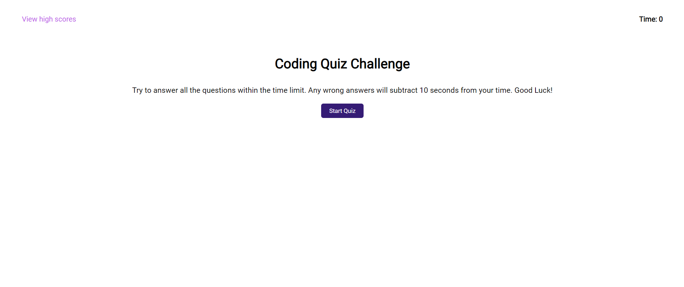
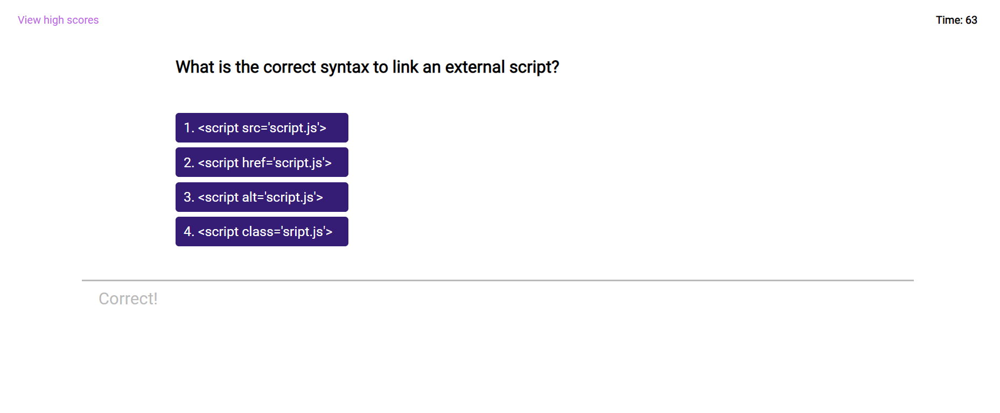
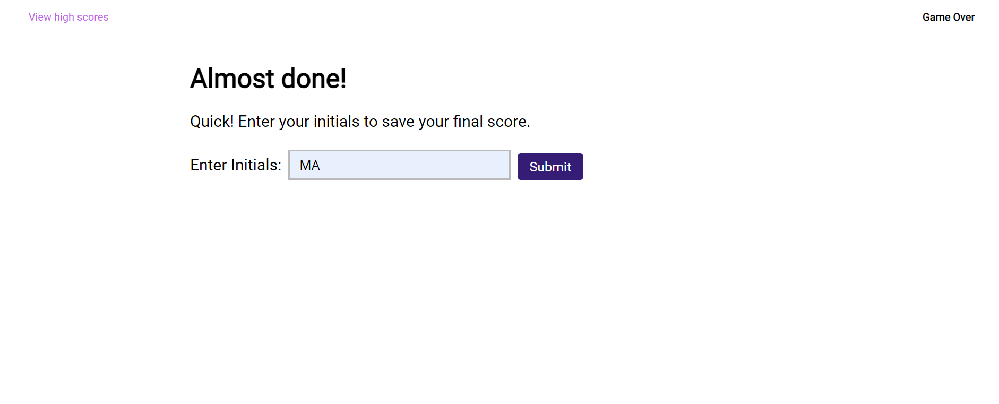
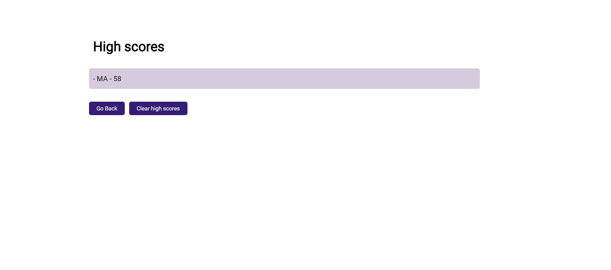

# Code-Quiz

## Website

https://mavila6.github.io/code-quiz/

## Description

A timed quiz on JavaScript fundamentals that stores high scores so that developers can put their skills to the test.

## Table of Contents

- [Built With](#built-with)
- [Screenshots](#screenshots)
- [Acknowledgements](#acknowledgements)
- [Questions](#questions)
- [Author](#author)

### Built-With

### Screenshots

### Acknowledgements

- Used Web Dev Simplified's "[Build A Quiz App With JavaScript](https://youtu.be/riDzcEQbX6k)" video on youtube for reference.

- Collaborated with [Kama Castaneda](https://github.com/kamacasta) to complete this challenge.

- For best view of the quiz open in screens of min-width: 1474.

### Questions

If you have any questions feel free to take a look at my [GitHub](https://github.com/mavila6) or contact me at mavila6@email.arizona.edu

### Author

&copy; 2021 Marco Avila
